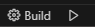

# OpenGLSGL

## Description
This project is a re-imagined version of the SGL engine made in JS for web browsers that didn't leverage hardware acceleration (GPU) APIs and did all the 3D through software-rendering. The same classes are used but instead we use OpenGL and C++ for a more "realistic" type of engine. 

**Warning: This project is for learning purpose of the OpenGL API, CMake tool and C++ language so it's not a fully optimized engine ready for use.**

## Git instructions (IMPORTANT)

Do all git cloning/fetching/pulling with this option to also get up-to-date submodules since other third-party repositories are referenced in this project.

`--recurse-submodules`

## Required tools for building the project
- CMake
- Make
- Python
- C/C++ compiler (MinGW preferably)

Those commands need to be executable from the current path

## Build and run project (manually)

PS: In this example, it assumes you're using MinGW for the compiler. If you use something else, you can change it inside the first command (replace "MinGW Makefiles" by your compiler).

### 1. Set up CMake and build cmake files

/> `cmake -G "MinGW Makefiles" -S . -B build`

### 2. Build binary

/> `cmake --build build`

## Execute

/> `./build/OpenGLSGL`

## Extras

### Set up through VSCode/VSCodium

PS: You might need to adjust the compiler path inside the `clangd.arguments` field in the `.vscode\settings.json` file for clangd to detect it correctly.

#### 1. Make sure you have the following extensions installed:
- https://open-vsx.org/extension/llvm-vs-code-extensions/vscode-clangd: Linter
- https://open-vsx.org/extension/ms-vscode/cmake-tools: CMake automatic builder

#### 2. Go on the CMakeLists.txt and save the file (Ctrl + S). It will generate the project CMake files automatically.

#### 3. You can now build and run the project from the little buttons in the bottom bar of the IDE. You will need to build the project at least once and restart your IDE so all errors are gone. This is because clangd expects some files to be present.

